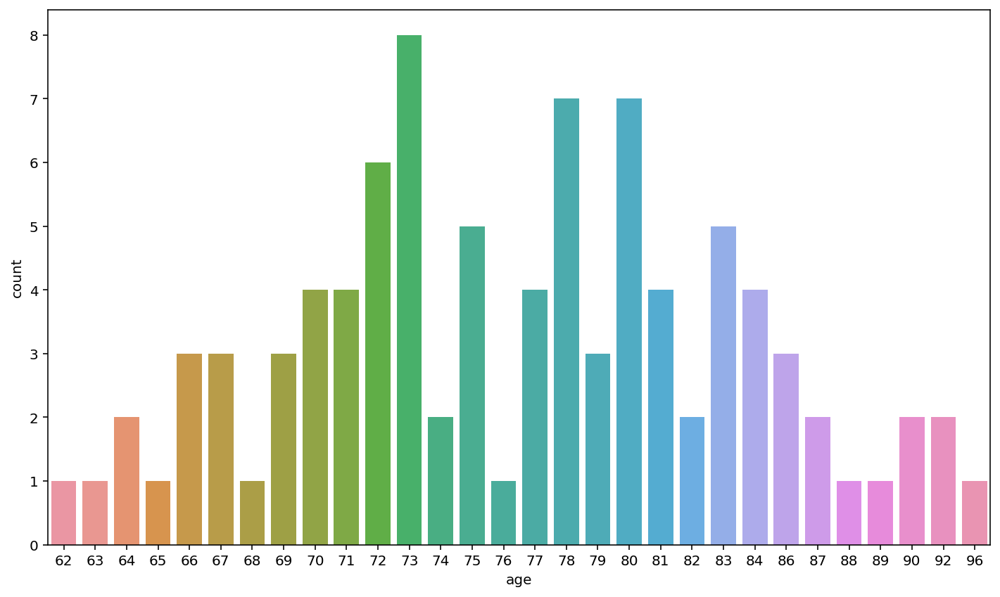

# DEMO NOTEBOOK #


```python
# Some code to create a pretty plot
sns.countplot(x="age",data= df_alz)
```


    <AxesSubplot:xlabel='age', ylabel='count'>





```python
# More code to create another plot
plt.plot(np_age, np_gmv, 'o')

m, b = np.polyfit(np_age, np_gmv, 1)

plt.plot(np_age, m*np_age + b)

plt.xlabel('Age')
plt.ylabel('Gray Matter Volume')
```


    Text(0, 0.5, 'Gray Matter Volume')


```python

```
